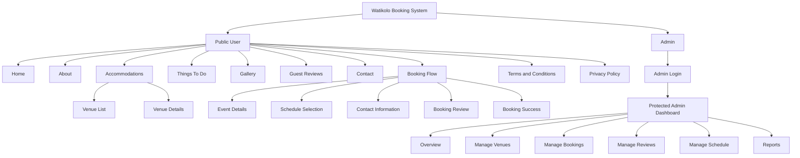

# Watikolo Program Hierarchy

This hierarchy shows the main user areas of the Watikolo booking system: the public user experience and the protected admin experience.

## Diagram



## Public User

Public users can browse resort information, review accommodations, and submit bookings.

```text
Watikolo Website
+-- Public User
    +-- Home
    |   +-- Landing page
    +-- About
    |   +-- Resort information
    +-- Accommodations
    |   +-- Venue list
    |   +-- Venue details
    +-- Things To Do
    |   +-- Activities and attractions
    +-- Gallery
    |   +-- Resort photos
    +-- Guest Reviews
    |   +-- Customer feedback
    +-- Contact
    |   +-- Inquiry form and contact details
    +-- Booking
    |   +-- Event details
    |   +-- Schedule selection
    |   +-- Contact information
    |   +-- Booking review
    |   +-- Booking success
    +-- Terms and Conditions
    +-- Privacy Policy
```

### Public User Routes

| Feature | Route |
| --- | --- |
| Home | `/` |
| About | `/about` |
| Accommodations | `/venues` |
| Venue Details | `/venues/:id`, `/venue/:id` |
| Things To Do | `/things-to-do` |
| Gallery | `/gallery` |
| Guest Reviews | `/guest-reviews` |
| Contact | `/contact` |
| Booking | `/booking` |
| Booking Success | `/booking/success` |
| Terms and Conditions | `/terms-and-conditions` |
| Privacy Policy | `/privacy-policy` |

## Admin

Admins sign in through a dedicated login page before accessing management tools.

```text
Watikolo Admin Console
+-- Admin
    +-- Login
    +-- Protected Admin Dashboard
        +-- Overview
        |   +-- Dashboard metrics and summaries
        +-- Venues
        |   +-- Manage accommodations and venue details
        +-- Bookings
        |   +-- View and manage customer bookings
        +-- Reviews
        |   +-- Moderate guest reviews
        +-- Schedule
        |   +-- Manage available dates and time slots
        +-- Reports
            +-- View booking and business reports
```

### Admin Routes

| Feature | Route |
| --- | --- |
| Admin Login | `/admin/login` |
| Admin Overview | `/admin` |
| Manage Venues | `/admin/venues` |
| Manage Bookings | `/admin/bookings` |
| Manage Reviews | `/admin/reviews` |
| Manage Schedule | `/admin/schedule` |
| Reports | `/admin/reports` |
